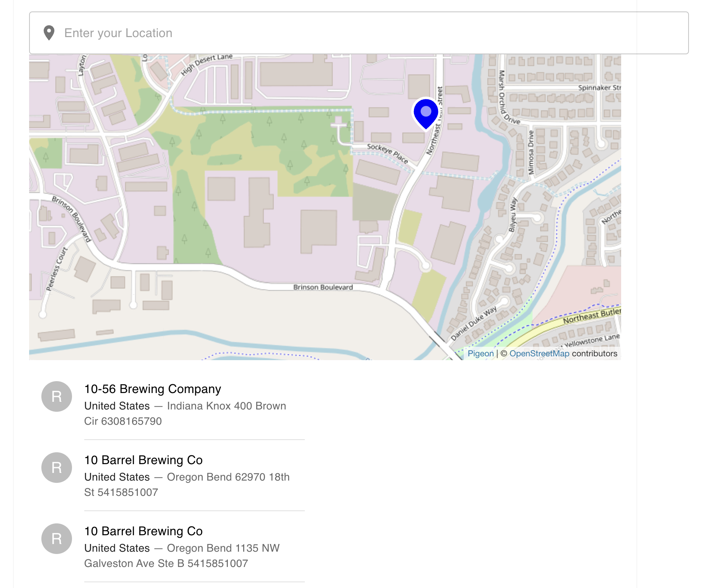

# Brew UI
Progess: 
I was able to consume the api, 
I was able to display the markers on the map,
i was able to get list of breweries,

# challenges:
the api does not support united kingdom cities,
i could not use the user current location to set the default search for the brewery api,
some latitude and longitude value were missing

# what i can do better
make the ui more interactive by adding features such as autocomplete
look for alternative and flexible api that can fetch globally
add name to the markers on the map
make the ui responsive for mobile user

# what i did not do well
i did not use either of redux or context api in the implementation since this is a three hours task
i just manage the state with prop drilling

# brew-ui
how to run 
``npm run install``
``npm run start``

# brew-ui
# brew-uii
